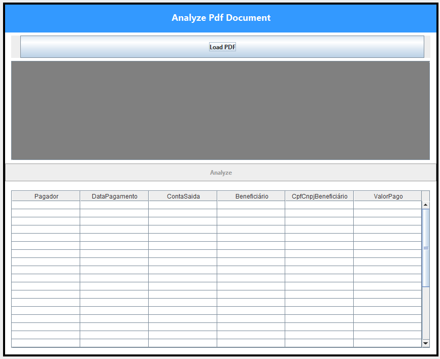
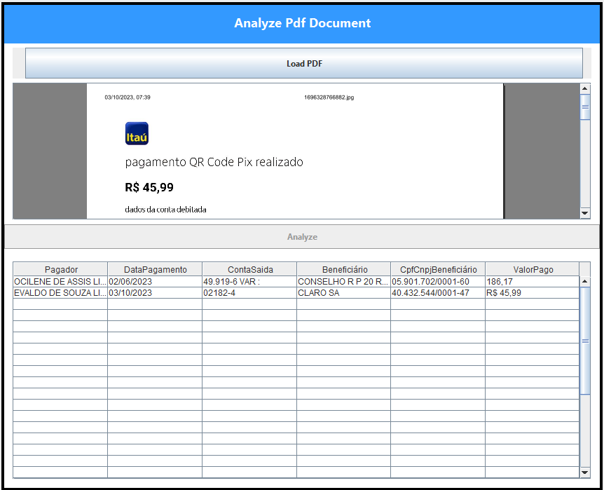
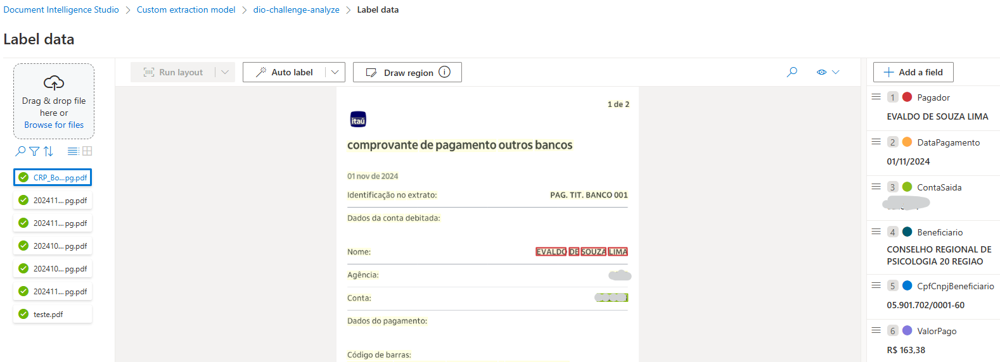
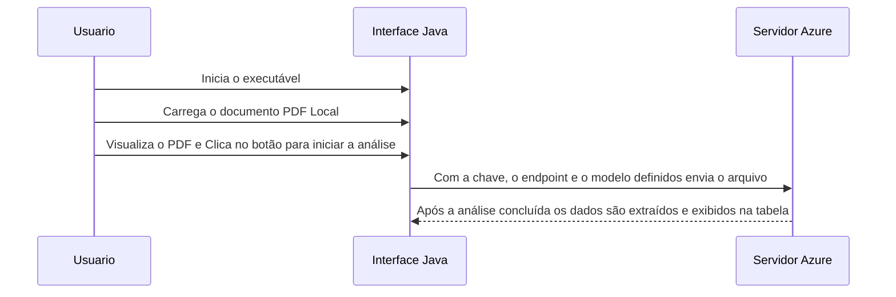

# AzureAnalyzeIA
Using AI to translate recognize documents after training of AI
# Documentação do Projeto de Inteligência Artificial Treinada para reconhecer documentos específicos com Azure

## Descrição do Projeto
Este projeto foi desenvolvido em Java Swing com o objetivo de criar um software que possa reconhecer os comprovantes de pagamentos emitidos pelo banco Itaú e extrair as informações mais relevantes e exibir em uma tabela empregando os serviços de IA da Azure. 

## Estrutura do Projeto

### Tela Inicial


### Tela Após Análise Concluída


### Tela do Processo de Treinamento da IA



### Diagrama de Sequência


## Estrutura do Arquivo `FormControl.java`
```java
    private static final String endpoint = "<YOUR ENDPOINT>";
    private static final String key = "<YOUR KEY>";
    String modelId = "evaldo-training"; //Use o seu modelo criado
```

## Como Utilizar
1. **Configuração Inicial**: Carregue o PDF conforme o modelo que treinou.
2. **Interface Gráfica**:
   - **Botão `Load PDF`**: Escolha o PDF dentro do padrão de treino.
   - **Botão `Analyze`**: É liberado quando há algum PDF válido pré-visualizado.
3. **Execução**:
   - É enviado o PDF juntamento com os parâmetros de configuração do Azure
   - O extrato do documento é obtido conforme os campos que foram utilizados para treinar a IA.

## Lista de Desejos (Versão 0.1)
Este projeto foi desenvolvido como parte de um desafio de projeto da Digital Innovation One (DIO). As melhorias planejadas incluem:
1. Permitir a escolha de uma pasta com todos os Pdf para processamento em lote.
2. Preencher a planilha e exportar como xls.

## Contribuição
Sinta-se à vontade para enviar `pull requests` ou abrir `issues` para sugerir melhorias. Este projeto é uma ótima oportunidade para aprender e explorar a integração do Delphi com APIs REST modernas.

## Licença
Este projeto está licenciado sob a [MIT License](LICENSE).

https://github.com/limainfo

